# Casos de Uso

## Introdução

Os casos de uso são descrições detalhadas das interações entre os usuários (atores) e o sistema. Eles documentam o comportamento do sistema do ponto de vista do usuário, descrevendo as principais funcionalidades e como os atores interagem com elas. Cada caso de uso representa uma sequência específica de ações que proporcionam um resultado observável e de valor para o ator.

### Utilização

Os casos de uso são utilizados para:

1. Identificar e documentar os requisitos funcionais do sistema
2. Descrever o fluxo de interações entre usuários e sistema
3. Definir o escopo das funcionalidades
4. Servir como base para testes do sistema
5. Facilitar a comunicação entre stakeholders e desenvolvedores

## Índice de Casos de Uso

1. [Cadastro de Clientes](#caso-de-uso-1-cadastro-de-clientes)
2. [Cadastro de Veículos](#caso-de-uso-2-cadastro-de-veículos)
3. [Cadastro de Mecânicos](#caso-de-uso-3-cadastro-de-mecânicos)
4. [Criação de Ordens de Serviço](#caso-de-uso-4-criação-de-ordens-de-serviço-os)
5. [Designação de Veículos a Equipes](#caso-de-uso-5-designação-de-veículos-a-equipes-de-mecânicos)
6. [Consulta de Tabela de Referência](#caso-de-uso-6-consulta-de-tabela-de-referência-de-mão-de-obra)
7. [Cálculo do Valor Total da OS](#caso-de-uso-7-cálculo-do-valor-total-da-os)
8. [Autorização de Execução dos Serviços](#caso-de-uso-8-autorização-de-execução-dos-serviços-pelo-cliente)
9. [Atualização do Status da OS](#caso-de-uso-9-atualização-do-status-da-os)
10. [Entrada de Veículos](#caso-de-uso-10-entrada-de-veículos-para-conserto-ou-revisão)
11. [Inclusão de Serviços na OS](#caso-de-uso-11-inclusão-de-vários-serviços-na-os)
12. [Inclusão de Peças na OS](#caso-de-uso-12-inclusão-de-vários-tipos-de-peças-na-os)
13. [Associação de Veículos ao Cliente](#caso-de-uso-13-associação-de-vários-veículos-a-um-cliente)

### Caso de Uso 1: Cadastro de Clientes

**Ator Principal:** 😊 Atendente

**Fluxo Principal:**
1. O atendente acessa a funcionalidade de cadastro de clientes
2. O atendente preenche as informações do cliente (nome, endereço, telefone, etc.)
3. O atendente salva as informações do cliente
4. O sistema confirma o cadastro do cliente

#### Diagrama do Caso de Uso

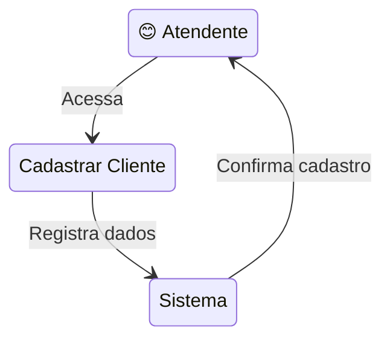

[🔝 Voltar ao topo](## Índice de Casos de Uso)

### Caso de Uso 2: Cadastro de Veículos

**Ator Principal:** 😊 Atendente

**Fluxo Principal:**
1. O atendente acessa a funcionalidade de cadastro de veículos
2. O atendente preenche as informações do veículo (marca, modelo, placa, etc.)
3. O atendente associa o veículo a um cliente
4. O atendente salva as informações do veículo
5. O sistema confirma o cadastro do veículo

#### Diagrama do Caso de Uso

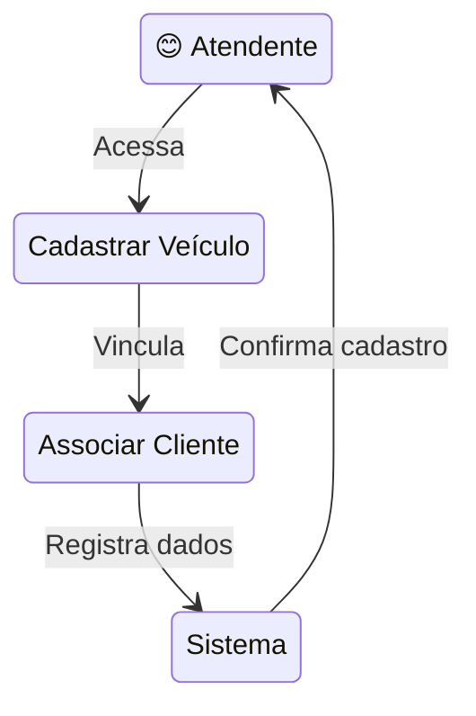

[🔝 Voltar ao topo](#casos-de-uso)

### Caso de Uso 3: Cadastro de Mecânicos

**Ator Principal:** 👨‍💼 Gerente

**Fluxo Principal:**
1. O gerente acessa a funcionalidade de cadastro de mecânicos
2. O gerente preenche as informações do mecânico (nome, endereço, especialidade, etc.)
3. O gerente salva as informações do mecânico
4. O sistema confirma o cadastro do mecânico

#### Diagrama do Caso de Uso

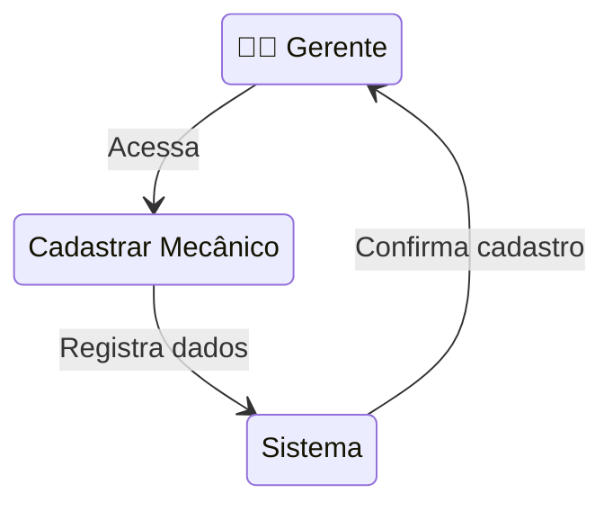

[🔝 Voltar ao topo](#casos-de-uso)

### Caso de Uso 4: Criação de Ordens de Serviço (OS)

**Ator Principal:** 😊 Atendente

**Fluxo Principal:**
1. O atendente acessa a funcionalidade de criação de ordens de serviço
2. O atendente preenche as informações da OS (número, data de emissão, valor, status, data de conclusão, etc.)
3. O atendente associa a OS a um veículo e a uma equipe de mecânicos
4. O atendente salva a OS
5. O sistema confirma a criação da OS

#### Diagrama do Caso de Uso

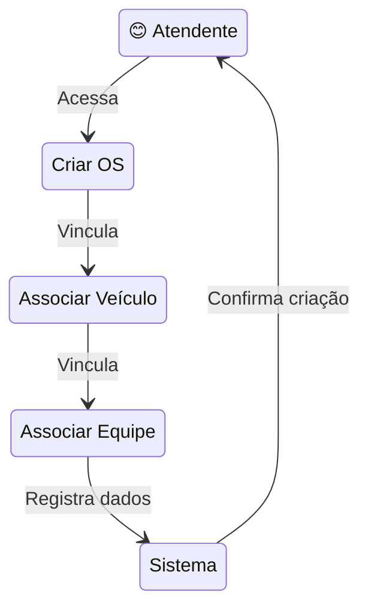

[🔝 Voltar ao topo](#casos-de-uso)

### Caso de Uso 5: Designação de Veículos a Equipes de Mecânicos

**Ator Principal:** 👨‍💼 Gerente

**Fluxo Principal:**
1. O gerente acessa a funcionalidade de designação de veículos
2. O gerente seleciona o veículo e a equipe de mecânicos
3. O gerente salva a designação
4. O sistema confirma a designação

#### Diagrama do Caso de Uso

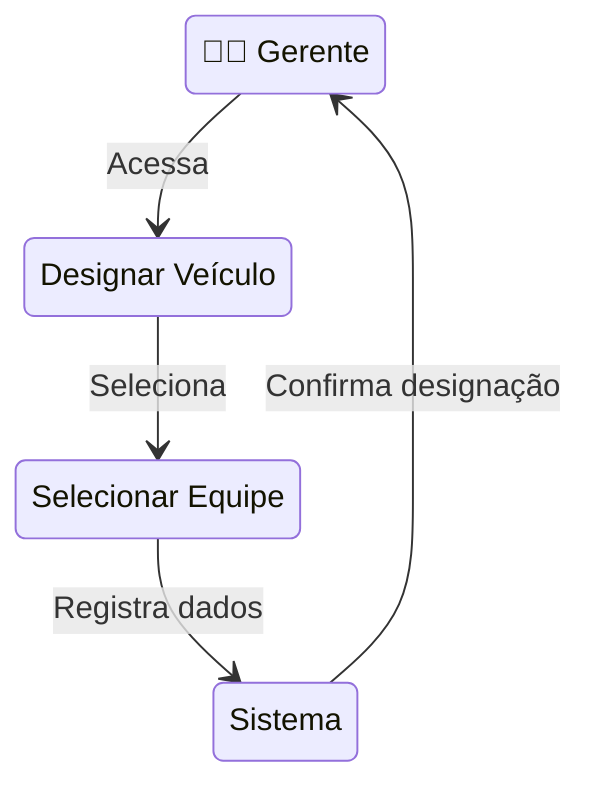

[🔝 Voltar ao topo](#casos-de-uso)

### Caso de Uso 6: Consulta de Tabela de Referência de Mão-de-Obra

**Ator Principal:** 😊 Atendente

**Fluxo Principal:**
1. O atendente acessa a funcionalidade de consulta de tabela de referência de mão-de-obra
2. O atendente busca o serviço na tabela
3. O sistema exibe o valor do serviço consultado

#### Diagrama do Caso de Uso

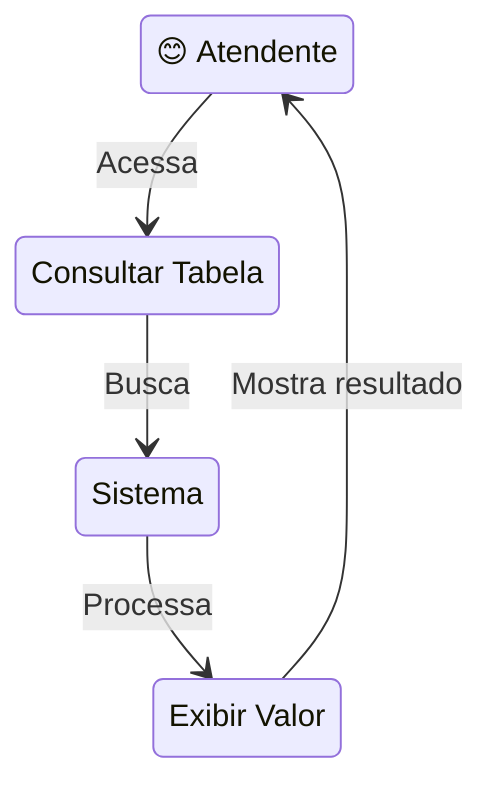

[🔝 Voltar ao topo](#casos-de-uso)

### Caso de Uso 7: Cálculo do Valor Total da OS

**Ator Principal:** 😊 Atendente

**Fluxo Principal:**
1. O atendente acessa a funcionalidade de cálculo do valor total da OS
2. O atendente inclui os serviços e peças na OS
3. O sistema calcula o valor total da OS
4. O sistema exibe o valor total para o atendente

#### Diagrama do Caso de Uso

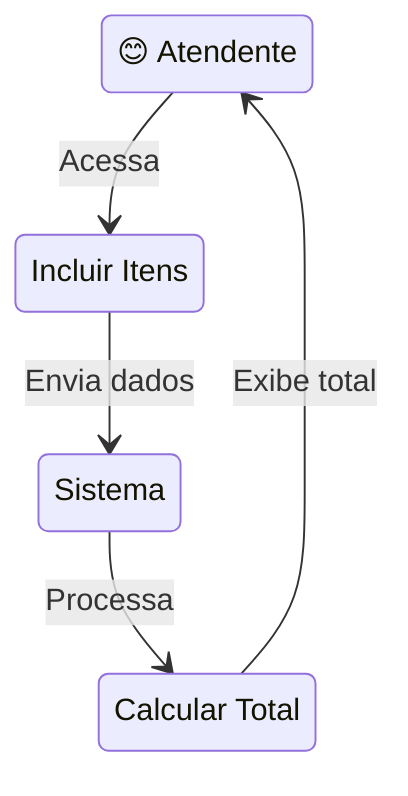

[🔝 Voltar ao topo](#casos-de-uso)

### Caso de Uso 8: Autorização de Execução dos Serviços pelo Cliente

**Ator Principal:** 😊 Atendente
**Ator Secundário:** 👤 Cliente

**Fluxo Principal:**
1. O atendente acessa a funcionalidade de autorização de serviços
2. O atendente apresenta a OS com os valores ao cliente
3. O cliente autoriza a execução dos serviços
4. O atendente registra a autorização
5. O sistema confirma a autorização

#### Diagrama do Caso de Uso

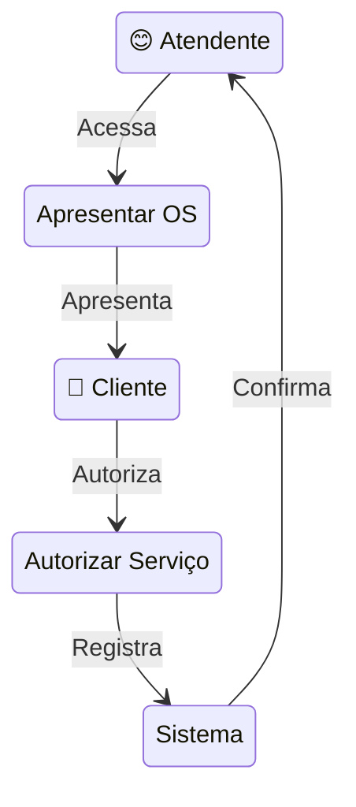

[🔝 Voltar ao topo](#casos-de-uso)

### Caso de Uso 9: Atualização do Status da OS

**Ator Principal:** 🔧 Mecânico

**Fluxo Principal:**
1. O mecânico acessa a funcionalidade de atualização de status da OS
2. O mecânico seleciona a OS a ser atualizada
3. O mecânico atualiza o status conforme o progresso dos serviços
4. O mecânico salva as alterações
5. O sistema confirma a atualização do status

#### Diagrama do Caso de Uso

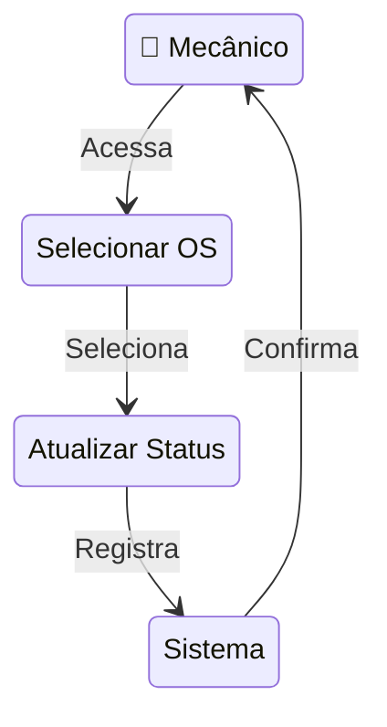

[🔝 Voltar ao topo](#casos-de-uso)

### Caso de Uso 10: Entrada de Veículos para Conserto ou Revisão

**Ator Principal:** 😊 Atendente

**Fluxo Principal:**
1. O atendente acessa a funcionalidade de entrada de veículos
2. O atendente seleciona o tipo de serviço (conserto ou revisão)
3. O atendente associa o veículo ao cliente
4. O atendente salva as informações
5. O sistema confirma a entrada do veículo

#### Diagrama do Caso de Uso

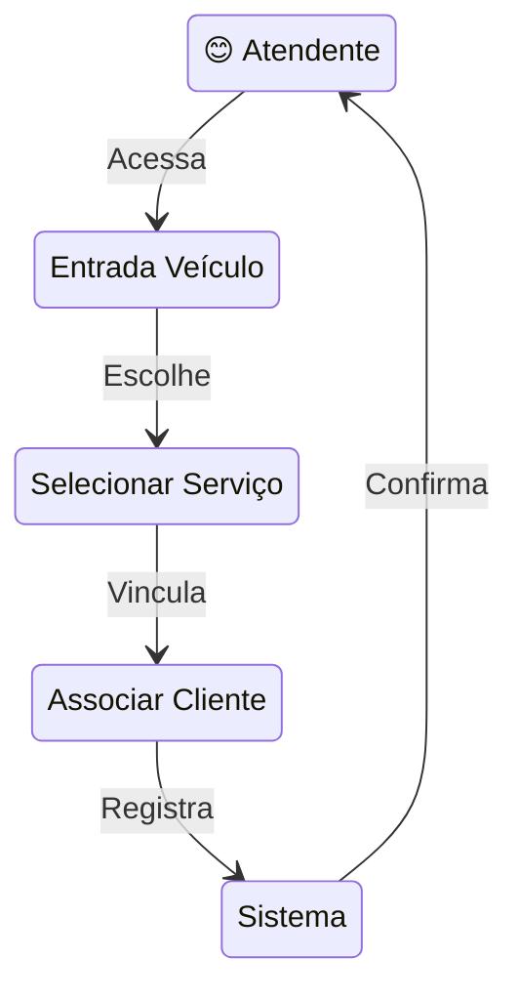

[🔝 Voltar ao topo](#casos-de-uso)

### Caso de Uso 11: Inclusão de Vários Serviços na OS

**Ator Principal:** 😊 Atendente

**Fluxo Principal:**
1. O atendente acessa a funcionalidade de criação de ordens de serviço
2. O atendente inclui vários serviços na OS
3. O atendente salva a OS
4. O sistema confirma a criação da OS com os serviços incluídos

#### Diagrama do Caso de Uso

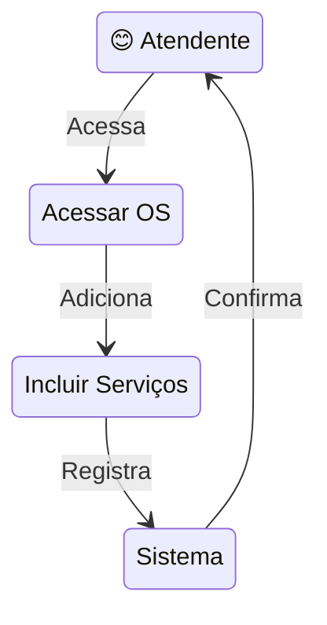

[🔝 Voltar ao topo](#casos-de-uso)

### Caso de Uso 12: Inclusão de Vários Tipos de Peças na OS

**Ator Principal:** 😊 Atendente

**Fluxo Principal:**
1. O atendente acessa a funcionalidade de criação de ordens de serviço
2. O atendente inclui vários tipos de peças na OS
3. O atendente salva a OS
4. O sistema confirma a criação da OS com as peças incluídas

#### Diagrama do Caso de Uso

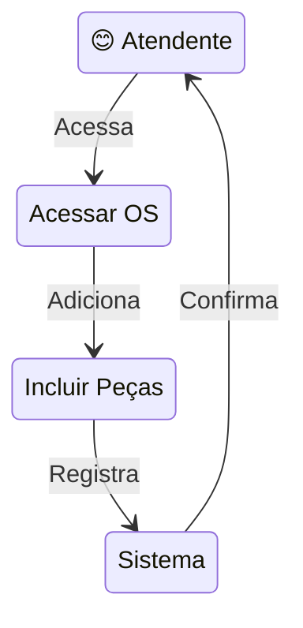

[🔝 Voltar ao topo](#casos-de-uso)

### Caso de Uso 13: Associação de Vários Veículos ao Cliente

**Ator Principal:** 😊 Atendente

**Fluxo Principal:**
1. O atendente acessa a funcionalidade de cadastro de veículos
2. O atendente associa vários veículos a um cliente
3. O atendente salva as informações
4. O sistema confirma a associação dos veículos ao cliente

#### Diagrama do Caso de Uso

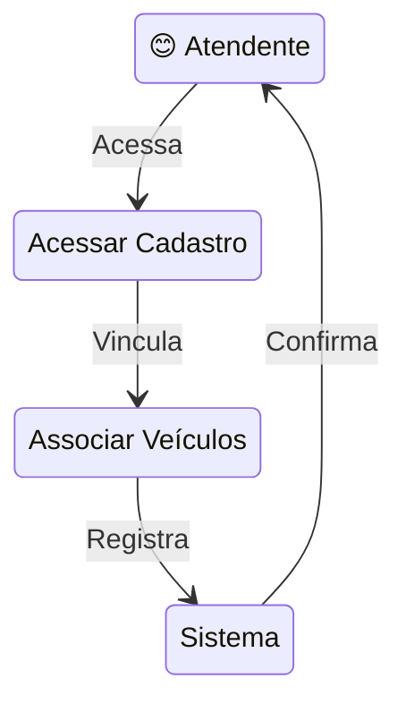

[🔝 Voltar ao topo](#casos-de-uso)
