```mermaid
stateDiagram-v2
    Atendente: 😊 Atendente
    Sistema: Sistema
    CadastroCliente: Cadastrar Cliente
    
    Atendente --> CadastroCliente: Acessa
    CadastroCliente --> Sistema: Registra dados
    Sistema --> Atendente: Confirma cadastro
```

```mermaid
stateDiagram-v2
    Atendente: 😊 Atendente
    Sistema: Sistema
    CadastroVeiculo: Cadastrar Veículo
    AssociarCliente: Associar Cliente
    
    Atendente --> CadastroVeiculo: Acessa
    CadastroVeiculo --> AssociarCliente: Vincula
    AssociarCliente --> Sistema: Registra dados
    Sistema --> Atendente: Confirma cadastro
```

```mermaid
stateDiagram-v2
    Gerente: 👨‍💼 Gerente
    Sistema: Sistema
    CadastroMecanico: Cadastrar Mecânico
    
    Gerente --> CadastroMecanico: Acessa
    CadastroMecanico --> Sistema: Registra dados
    Sistema --> Gerente: Confirma cadastro
```

```mermaid
stateDiagram-v2
    Atendente: 😊 Atendente
    Sistema: Sistema
    CriarOS: Criar OS
    AssociarVeiculo: Associar Veículo
    
    Atendente --> CriarOS: Acessa
    CriarOS --> AssociarVeiculo: Vincula
    AssociarVeiculo --> Sistema: Registra dados
    Sistema --> Atendente: Confirma criação
```

```mermaid
stateDiagram-v2
    Gerente: 👨‍💼 Gerente
    Sistema: Sistema
    DesignarVeiculo: Designar Veículo
    SelecionarEquipe: Selecionar Equipe
    
    Gerente --> DesignarVeiculo: Acessa
    DesignarVeiculo --> SelecionarEquipe: Seleciona
    SelecionarEquipe --> Sistema: Registra dados
    Sistema --> Gerente: Confirma designação
```

```mermaid
stateDiagram-v2
    Mecanico: 🔧 Mecânico
    Sistema: Sistema
    AcessarOS: Acessar OS
    InformarItens: Informar Itens
    
    Mecanico --> AcessarOS: Acessa
    AcessarOS --> InformarItens: Preenche
    InformarItens --> Sistema: Registra
    Sistema --> Mecanico: Confirma
```

```mermaid
stateDiagram-v2
    Atendente: 😊 Atendente
    Sistema: Sistema
    ConsultarTabela: Consultar Tabela
    ExibirValor: Exibir Valor
    
    Atendente --> ConsultarTabela: Acessa
    ConsultarTabela --> Sistema: Busca
    Sistema --> ExibirValor: Processa
    ExibirValor --> Atendente: Mostra resultado
```

```mermaid
stateDiagram-v2
    Atendente: 😊 Atendente
    Sistema: Sistema
    CalcularTotal: Calcular Total
    ExibirValor: Exibir Valor
    
    Atendente --> CalcularTotal: Acessa
    CalcularTotal --> Sistema: Processa
    Sistema --> ExibirValor: Calcula
    ExibirValor --> Atendente: Mostra total
```

```mermaid
stateDiagram-v2
    Atendente: 😊 Atendente
    Cliente: 👤 Cliente
    Sistema: Sistema
    ApresentarOS: Apresentar OS
    AutorizarServico: Autorizar Serviço
    AlterarStatus: Alterar Status
    
    Atendente --> ApresentarOS: Acessa
    ApresentarOS --> Cliente: Apresenta
    Cliente --> AutorizarServico: Autoriza
    AutorizarServico --> Sistema: Registra
    Sistema --> AlterarStatus: Atualiza
    AlterarStatus --> Atendente: Confirma
```

```mermaid
stateDiagram-v2
    Mecanico: 🔧 Mecânico
    Sistema: Sistema
    SelecionarOS: Selecionar OS
    AtualizarStatus: Atualizar Status
    
    Mecanico --> SelecionarOS: Acessa
    SelecionarOS --> AtualizarStatus: Seleciona
    AtualizarStatus --> Sistema: Registra
    Sistema --> Mecanico: Confirma
```

# Casos de Uso

## Introdução

Os casos de uso são descrições detalhadas das interações entre os usuários (atores) e o sistema. Eles documentam o comportamento do sistema do ponto de vista do usuário, descrevendo as principais funcionalidades e como os atores interagem com elas. Cada caso de uso representa uma sequência específica de ações que proporcionam um resultado observável e de valor para o ator.

### Utilização

Os casos de uso são utilizados para:

1. Identificar e documentar os requisitos funcionais do sistema
2. Descrever o fluxo de interações entre usuários e sistema
3. Definir o escopo das funcionalidades
4. Servir como base para testes do sistema
5. Facilitar a comunicação entre stakeholders e desenvolvedores

## Índice de Casos de Uso

1. [Cadastro de Clientes](#caso-de-uso-1-cadastro-de-clientes)
2. [Cadastro de Veículos](#caso-de-uso-2-cadastro-de-veículos)
3. [Cadastro de Mecânicos](#caso-de-uso-3-cadastro-de-mecânicos)
4. [Entrada de Veículos](#caso-de-uso-4-entrada-de-veículos-para-conserto-ou-revisão)
5. [Criação de OS](#caso-de-uso-5-criação-de-ordens-de-serviço-os)
6. [Designação de Veículos a Equipes](#caso-de-uso-6-designação-de-veículos-a-equipes-de-mecânicos)
7. [Orçamento](#caso-de-uso-7-orçamento)
8. [Consulta Tabela de Referência](#caso-de-uso-8-consulta-de-tabela-de-referência-de-mão-de-obra)
9. [Cálculo Valor Total](#caso-de-uso-9-cálculo-do-valor-total-da-os)
10. [Autorização dos Serviços](#caso-de-uso-10-autorização-de-execução-dos-serviços-pelo-cliente)
11. [Atualização Status da OS](#caso-de-uso-11-atualização-do-status-da-os)

### Caso de Uso 1: Cadastro de Clientes

**Ator Principal:** 😊 Atendente

**Fluxo Principal:**
1. O atendente acessa a funcionalidade de cadastro de clientes
2. O atendente preenche as informações do cliente (nome, endereço, telefone, etc.)
3. O atendente salva as informações do cliente
4. O sistema confirma o cadastro do cliente

#### Diagrama do Caso de Uso

[🔝 Voltar ao topo](#casos-de-uso)

### Caso de Uso 2: Cadastro de Veículos

**Ator Principal:** 😊 Atendente

**Fluxo Principal:**
1. O atendente acessa a funcionalidade de cadastro de veículos
2. O atendente preenche as informações do veículo (marca, modelo, placa, etc.)
3. O atendente associa o veículo a um cliente
4. O atendente salva as informações do veículo
5. O sistema confirma o cadastro do veículo

#### Diagrama do Caso de Uso

[🔝 Voltar ao topo](#casos-de-uso)

### Caso de Uso 3: Cadastro de Mecânicos

**Ator Principal:** 👨‍💼 Gerente

**Fluxo Principal:**
1. O gerente acessa a funcionalidade de cadastro de mecânicos
2. O gerente preenche as informações do mecânico (nome, endereço, especialidade, etc.)
3. O gerente salva as informações do mecânico
4. O sistema confirma o cadastro do mecânico

#### Diagrama do Caso de Uso

[🔝 Voltar ao topo](#casos-de-uso)

### Caso de Uso 4: Entrada de Veículos para Conserto ou Revisão

**Ator Principal:** 😊 Atendente

**Fluxo Principal:**
1. O atendente acessa a funcionalidade de entrada de veículos
2. O atendente seleciona o tipo de serviço (conserto ou revisão)
3. O atendente associa o veículo ao cliente
4. O atendente salva as informações
5. O sistema confirma a entrada do veículo

#### Diagrama do Caso de Uso

[🔝 Voltar ao topo](#casos-de-uso)

### Caso de Uso 5: Criação de Ordens de Serviço (OS)

**Ator Principal:** 😊 Atendente

**Fluxo Principal:**
1. O atendente acessa a funcionalidade de criação de ordens de serviço
2. O atendente preenche as informações da OS (data de emissão, status)
3. O atendente associa a OS a um veículo
4. O atendente salva a OS
5. O sistema confirma a criação da OS

#### Diagrama do Caso de Uso

[🔝 Voltar ao topo](#casos-de-uso)

### Caso de Uso 6: Designação de Veículos a Equipes de Mecânicos

**Ator Principal:** 👨‍💼 Gerente

**Fluxo Principal:**
1. O gerente acessa a funcionalidade de designação de veículos
2. O gerente seleciona o veículo e a equipe de mecânicos
3. O gerente salva a designação
4. O sistema confirma a designação

#### Diagrama do Caso de Uso

[🔝 Voltar ao topo](#casos-de-uso)

### Caso de Uso 7: Orçamento

**Ator Principal:** 🔧 Mecânico

**Fluxo Principal:**
1. O mecânico acessa a funcionalidade de orçamento na OS
2. O mecânico seleciona a OS a ser orçada
3. O mecânico informa os serviços e peças
4. O mecânico salva as alterações
5. O sistema confirma a atualização orçamento

#### Diagrama do Caso de Uso

[🔝 Voltar ao topo](#casos-de-uso)

### Caso de Uso 8: Consulta de Tabela de Referência de Mão-de-Obra

**Ator Principal:** 😊 Atendente

**Fluxo Principal:**
1. O atendente acessa a funcionalidade de consulta de tabela de referência de mão-de-obra
2. O atendente busca o serviço na tabela
3. O sistema exibe o valor do serviço consultado

#### Diagrama do Caso de Uso

[🔝 Voltar ao topo](#casos-de-uso)

### Caso de Uso 9: Cálculo do Valor Total da OS

**Ator Principal:** 😊 Atendente

**Fluxo Principal:**
1. O atendente acessa a funcionalidade de cálculo do valor total da OS
2. O atendente inclui as peças na OS
3. O sistema calcula o valor total da OS
4. O sistema exibe o valor total para o atendente

#### Diagrama do Caso de Uso

[🔝 Voltar ao topo](#casos-de-uso)

### Caso de Uso 10: Autorização de Execução dos Serviços pelo Cliente

**Ator Principal:** 😊 Atendente
**Ator Secundário:** 👤 Cliente

**Fluxo Principal:**
1. O atendente acessa a funcionalidade de autorização de serviços
2. O atendente apresenta a OS com os valores ao cliente
3. O cliente autoriza a execução dos serviços
4. O atendente registra a autorização
5. O sistema confirma a autorização
6. O sistema altera o status da OS para entrar na fila de atendimento

#### Diagrama do Caso de Uso

[🔝 Voltar ao topo](#casos-de-uso)

### Caso de Uso 11: Atualização do Status da OS

**Ator Principal:** 🔧 Mecânico

**Fluxo Principal:**
1. O mecânico acessa a funcionalidade de atualização de status da OS
2. O mecânico seleciona a OS a ser atualizada
3. O mecânico atualiza o status conforme o progresso dos serviços
4. O mecânico salva as alterações
5. O sistema confirma a atualização do status

#### Diagrama do Caso de Uso

[🔝 Voltar ao topo](#casos-de-uso)
