# Diagrama de Classes

## Introdução

Um diagrama de classes é um tipo de diagrama estático que descreve a estrutura de um sistema mostrando suas classes, atributos, operações (ou métodos) e os relacionamentos entre os objetos. Os diagramas de classes são amplamente utilizados na modelagem de sistemas orientados a objetos, pois ajudam a visualizar e documentar a arquitetura do sistema.

### Utilização

O diagrama de classes é utilizado para:

1. Mostrar as classes que compõem o sistema.
2. Definir os atributos e métodos das classes.
3. Representar as associações entre as classes.
4. Documentar a herança e a composição entre as classes.
5. Facilitar a compreensão da estrutura do sistema e o design orientado a objetos.

### Diagrama de Classes

```mermaid
classDiagram
    class Cliente {
        <<entity>>
        +int id
        +string nome
        +string endereco
        +string telefone
        +string email
        +cadastrarCliente()
        +atualizarDados()
        +consultarHistorico()
    }
    style Cliente fill:#404040

    class Veiculo {
        <<entity>>
        +int id
        +string placa
        +string marca
        +string modelo
        +int ano
        +cadastrarVeiculo()
        +vincularCliente()
        +consultarHistorico()
    }
    style Veiculo fill:#4A4A4A

    class OrdemServico {
        <<entity>>
        +int numero
        +date dataEmissao
        +date dataConclusao
        +float valor
        +string status
        +criarOS()
        +calcularValor()
        +atualizarStatus()
        +finalizarOS()
    }
    style OrdemServico fill:#545454

    class Mecanico {
        <<entity>>
        +int id
        +string nome
        +string especialidade
        +string telefone
        +cadastrarMecanico()
        +atribuirServico()
        +registrarDiagnostico()
    }
    style Mecanico fill:#5E5E5E

    class Servico {
        <<entity>>
        +int id
        +string descricao
        +float valorMaoDeObra
        +float tempoEstimado
        +cadastrarServico()
        +calcularCusto()
        +atualizarStatus()
    }
    style Servico fill:#686868

    class Peca {
        <<entity>>
        +int id
        +string nome
        +string codigo
        +float valor
        +int quantidade
        +cadastrarPeca()
        +atualizarEstoque()
        +consultarDisponibilidade()
    }
    style Peca fill:#727272

    Cliente "1" -- "*" Veiculo : possui
    Cliente "1" -- "*" OrdemServico : solicita
    Veiculo "1" -- "*" OrdemServico : possui
    OrdemServico "1" -- "*" Mecanico : executada por
    OrdemServico "1" -- "*" Servico : inclui
    OrdemServico "1" -- "*" Peca : utiliza
    Mecanico "*" -- "*" Servico : realiza
```

