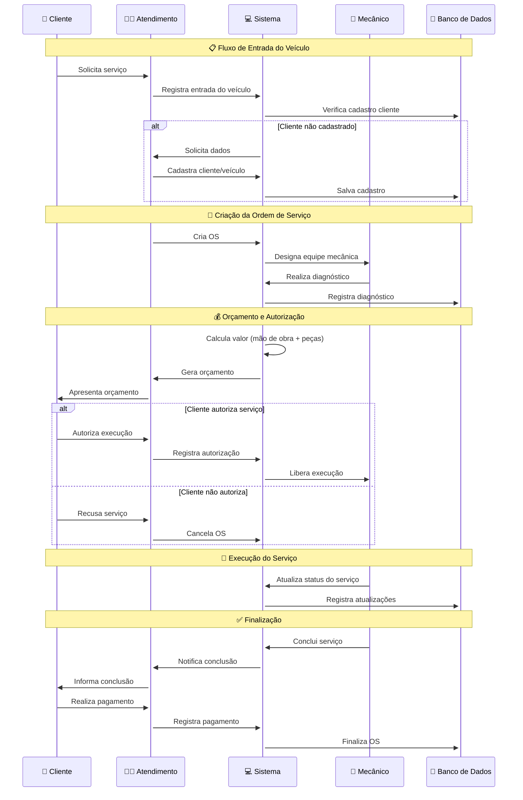

# Diagrama de Sequência

## Introdução

Um diagrama de sequência é um tipo de diagrama de interação que mostra como os objetos interagem em um cenário específico de um determinado caso de uso. Ele ilustra a sequência de mensagens trocadas entre os objetos para realizar uma funcionalidade.

### Utilização

O diagrama de sequência é utilizado para:

1. Mostrar a interação entre os objetos em um caso de uso específico.
2. Representar a ordem das mensagens trocadas entre os objetos.
3. Documentar os eventos que ocorrem durante a execução de um processo.
4. Facilitar a compreensão do fluxo de controle e a lógica dos casos de uso.
5. Identificar possíveis melhorias e otimizações no processo.

### Diagrama Sequência

