# Diagrama de Sequência

## Introdução

Um diagrama de sequência é um tipo de diagrama de interação que mostra como os objetos interagem em um cenário específico de um determinado caso de uso. Ele ilustra a sequência de mensagens trocadas entre os objetos para realizar uma funcionalidade.

### Utilização

O diagrama de sequência é utilizado para:

1. Mostrar a interação entre os objetos em um caso de uso específico.
2. Representar a ordem das mensagens trocadas entre os objetos.
3. Documentar os eventos que ocorrem durante a execução de um processo.
4. Facilitar a compreensão do fluxo de controle e a lógica dos casos de uso.
5. Identificar possíveis melhorias e otimizações no processo.

### Diagrama Sequência

```mermaid
sequenceDiagram
    participant Cliente as 🧑 Cliente #FFB6C1
    participant Atendimento as 👨‍💼 Atendimento #98FB98
    participant Sistema as 💻 Sistema #87CEEB
    participant Mecânico as 🔧 Mecânico #DDA0DD
    participant BancoDados as 💾 Banco de Dados #FFE4B5

    Note over Cliente,BancoDados: 📋 Fluxo de Entrada do Veículo
    Cliente->>+Atendimento: Solicita serviço
    Atendimento->>+Sistema: Registra entrada do veículo
    Sistema->>+BancoDados: Verifica cadastro cliente
    
    alt Cliente não cadastrado
        Sistema->>Atendimento: Solicita dados
        Atendimento->>Sistema: Cadastra cliente/veículo
        Sistema->>BancoDados: Salva cadastro
    end

    Note over Cliente,BancoDados: 📝 Criação da Ordem de Serviço
    Atendimento->>Sistema: Cria OS
    Sistema->>Mecânico: Designa equipe mecânica
    Mecânico->>Sistema: Realiza diagnóstico
    Sistema->>BancoDados: Registra diagnóstico

    Note over Cliente,BancoDados: 💰 Orçamento e Autorização
    Sistema->>Sistema: Calcula valor (mão de obra + peças)
    Sistema->>Atendimento: Gera orçamento
    Atendimento->>Cliente: Apresenta orçamento
    
    alt Cliente autoriza serviço
        Cliente->>Atendimento: Autoriza execução
        Atendimento->>Sistema: Registra autorização
        Sistema->>Mecânico: Libera execução
    else Cliente não autoriza
        Cliente->>Atendimento: Recusa serviço
        Atendimento->>Sistema: Cancela OS
    end

    Note over Cliente,BancoDados: 🔨 Execução do Serviço
    Mecânico->>Sistema: Atualiza status do serviço
    Sistema->>BancoDados: Registra atualizações
    
    Note over Cliente,BancoDados: ✅ Finalização
    Mecânico->>Sistema: Conclui serviço
    Sistema->>Atendimento: Notifica conclusão
    Atendimento->>Cliente: Informa conclusão
    Cliente->>Atendimento: Realiza pagamento
    Atendimento->>Sistema: Registra pagamento
    Sistema->>BancoDados: Finaliza OS
```

