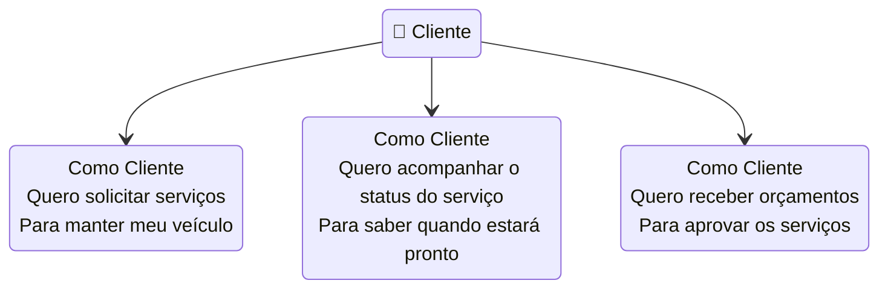
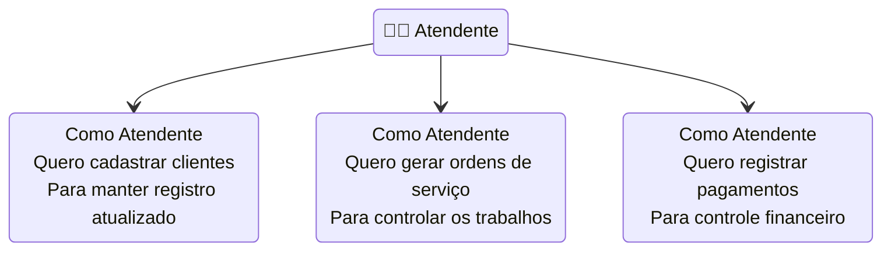
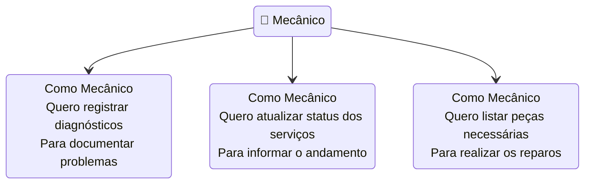
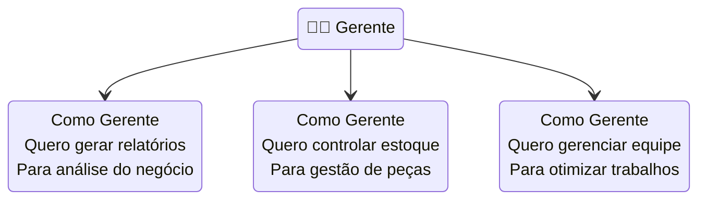

# Histórias de Usuário

## Introdução

As histórias de usuário são descrições curtas e simples de uma funcionalidade do sistema, contadas sob a perspectiva do usuário. Elas ajudam a entender como os diferentes atores interagem com o sistema e quais são suas necessidades principais.

### Utilização

As histórias de usuário são utilizadas para:

1. Capturar os requisitos do sistema do ponto de vista do usuário
2. Definir o escopo das funcionalidades
3. Planejar as entregas do projeto
4. Estabelecer prioridades de desenvolvimento
5. Facilitar a comunicação entre stakeholders

### Diagrama de Histórias de Usuário

#### Histórias do Cliente

#### Histórias do Atendente

#### Histórias do Mecânico

#### Histórias do Gerente

