# Histórias de Usuário

## Introdução

As histórias de usuário são descrições curtas e simples de uma funcionalidade do sistema, contadas sob a perspectiva do usuário. Elas ajudam a entender como os diferentes atores interagem com o sistema e quais são suas necessidades principais.

### Utilização

As histórias de usuário são utilizadas para:

1. Capturar os requisitos do sistema do ponto de vista do usuário
2. Definir o escopo das funcionalidades
3. Planejar as entregas do projeto
4. Estabelecer prioridades de desenvolvimento
5. Facilitar a comunicação entre stakeholders

### Diagrama de Histórias de Usuário

#### Histórias do Cliente

```mermaid
stateDiagram-v2
    Cliente: 👤 Cliente
    US1: Como Cliente<br/>Quero solicitar serviços<br/>Para manter meu veículo
    US2: Como Cliente<br/>Quero acompanhar o status do serviço<br/>Para saber quando estará pronto
    US3: Como Cliente<br/>Quero receber orçamentos<br/>Para aprovar os serviços

    Cliente --> US1
    Cliente --> US2
    Cliente --> US3
```

#### Histórias do Atendente

```mermaid
stateDiagram-v2
    Atendente: 👨‍💼 Atendente
    US4: Como Atendente<br/>Quero cadastrar clientes<br/>Para manter registro atualizado
    US5: Como Atendente<br/>Quero gerar ordens de serviço<br/>Para controlar os trabalhos
    US6: Como Atendente<br/>Quero registrar pagamentos<br/>Para controle financeiro

    Atendente --> US4
    Atendente --> US5
    Atendente --> US6
```

#### Histórias do Mecânico

```mermaid
stateDiagram-v2
    Mecanico: 🔧 Mecânico
    US7: Como Mecânico<br/>Quero registrar diagnósticos<br/>Para documentar problemas
    US8: Como Mecânico<br/>Quero atualizar status dos serviços<br/>Para informar o andamento
    US9: Como Mecânico<br/>Quero listar peças necessárias<br/>Para realizar os reparos

    Mecanico --> US7
    Mecanico --> US8
    Mecanico --> US9
```

#### Histórias do Gerente

```mermaid
stateDiagram-v2
    Gerente: 👨‍💼 Gerente
    US10: Como Gerente<br/>Quero gerar relatórios<br/>Para análise do negócio
    US11: Como Gerente<br/>Quero controlar estoque<br/>Para gestão de peças
    US12: Como Gerente<br/>Quero gerenciar equipe<br/>Para otimizar trabalhos

    Gerente --> US10
    Gerente --> US11
    Gerente --> US12
```

