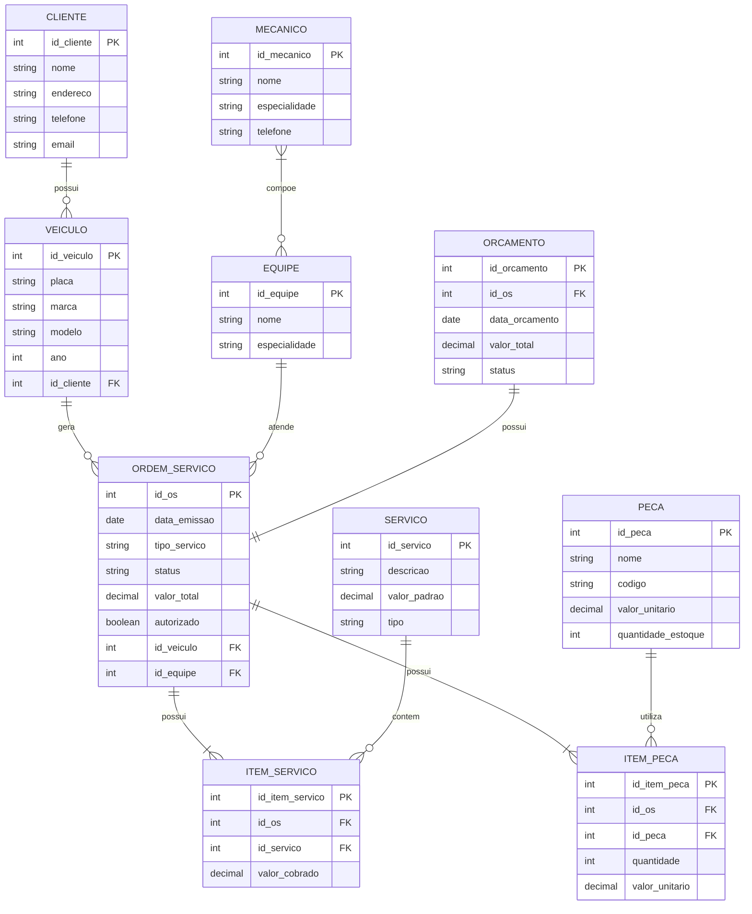
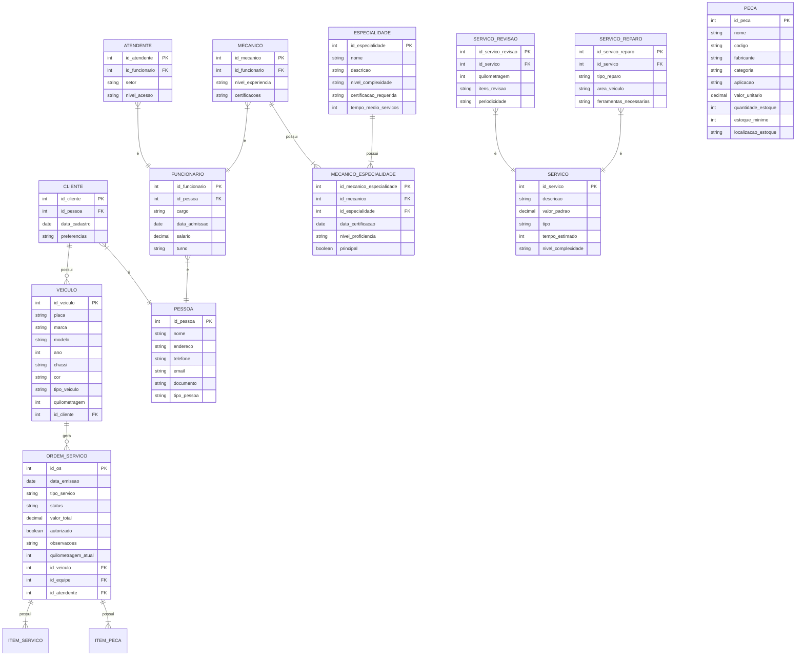

# Modelagem Conceitual do Banco de Dados

## Introdução

Este documento apresenta a modelagem conceitual do banco de dados para o Sistema de Controle e Gerenciamento de Execução de Ordens de Serviço em uma Oficina Mecânica.
O modelo foi desenvolvido com base nos requisitos, casos de uso e histórias de usuário previamente documentados.

## Diagrama Entidade-Relacionamento

## Descrição das Entidades

### CLIENTE
- Armazena informações dos clientes da oficina
- Relaciona-se com os veículos que possui

### VEICULO
- Registra dados dos veículos dos clientes
- Vinculado a um cliente e pode ter várias ordens de serviço

### MECANICO
- Contém dados dos mecânicos
- Pode fazer parte de uma ou mais equipes

### EQUIPE
- Representa grupos de trabalho de mecânicos
- Atende as ordens de serviço

### ORDEM_SERVICO
- Documento principal que registra os serviços
- Vinculada a um veículo e uma equipe
- Contém itens de serviço e peças

### SERVICO
- Catálogo de serviços oferecidos
- Possui valor padrão de referência

### ITEM_SERVICO
- Registra serviços específicos de uma OS
- Permite valor diferente do padrão

### PECA
- Cadastro de peças em estoque
- Controle de quantidade e valores

### ITEM_PECA
- Registra peças utilizadas em uma OS
- Mantém o valor praticado na época

### ORCAMENTO
- Vinculado a uma OS
- Registra valores e status da aprovação

## Principais Relacionamentos

1. Cliente possui vários Veículos (1:N)
2. Veículo gera várias Ordens de Serviço (1:N)
3. Equipe atende várias Ordens de Serviço (1:N)
4. Mecânico pode estar em várias Equipes (N:N)
5. Ordem de Serviço possui vários Itens de Serviço (1:N)
6. Ordem de Serviço possui vários Itens de Peça (1:N)
7. Ordem de Serviço possui um Orçamento (1:1)

## Observações

- O modelo suporta o controle de estoque de peças
- Permite o registro de valores diferentes do padrão para serviços
- Mantém histórico de preços praticados em cada OS
- Controla status de aprovação e execução dos serviços
- Possibilita a gestão de equipes e especialidades
- 

# Modelagem Conceitual do Banco de Dados - Com Especializações

## Descrição das Especializações

### 1. Especialização de PESSOA
- **Entidade Genérica:** PESSOA
- **Especializações:** 
  - CLIENTE
  - FUNCIONARIO (que por sua vez tem suas próprias especializações)

### 2. Especialização de FUNCIONARIO
- **Entidade Genérica:** FUNCIONARIO
- **Especializações:**
  - MECANICO (com relação com ESPECIALIDADE)
  - ATENDENTE

### 3. Especialização de SERVICO
- **Entidade Genérica:** SERVICO
- **Especializações:**
  - SERVICO_REVISAO
  - SERVICO_REPARO

### 4. Estrutura de ESPECIALIDADE
- **Entidade:** ESPECIALIDADE
- **Relacionamento:** N:N com MECANICO através de MECANICO_ESPECIALIDADE
- **Benefícios:**
  - Melhor controle das competências dos mecânicos
  - Histórico de certificações
  - Gestão de níveis de proficiência

## Benefícios das Especializações

1. **Melhor Organização dos Dados**
   - Separação clara entre diferentes tipos de entidades
   - Facilita a manutenção e evolução do sistema

2. **Maior Precisão nas Informações**
   - Atributos específicos para cada tipo de entidade
   - Melhor representação do mundo real

3. **Flexibilidade**
   - Facilita a adição de novos tipos de serviços
   - Permite evolução do sistema sem grandes mudanças estruturais

4. **Integridade dos Dados**
   - Regras de negócio mais claras
   - Melhor controle de acesso e permissões
