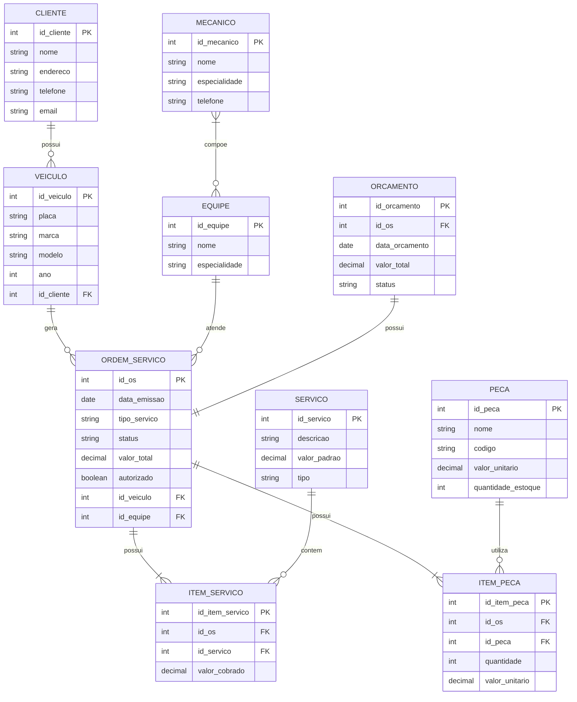
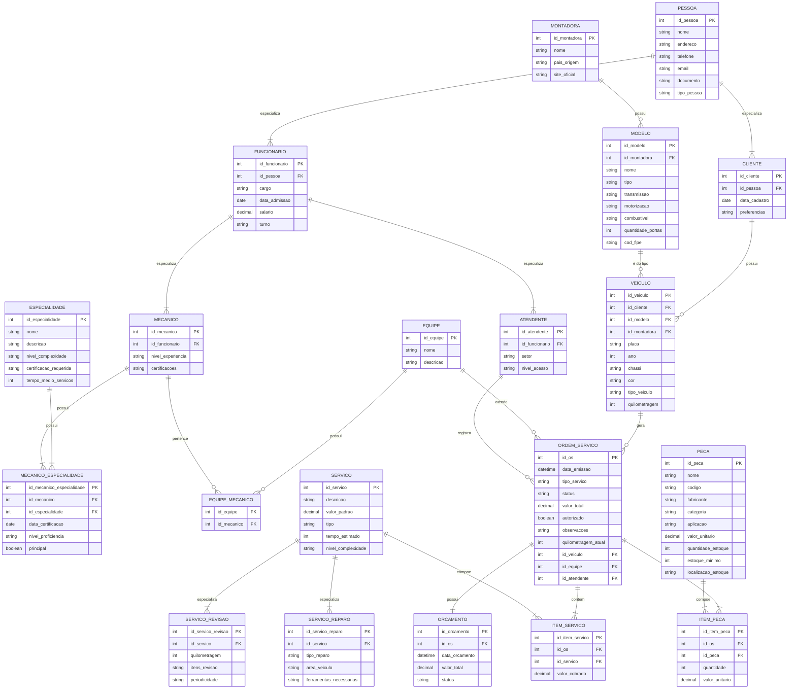

# Modelagem Conceitual do Banco de Dados

## Introdução
A modelagem conceitual é a primeira etapa no processo de design de um banco de dados, onde representamos as entidades do mundo real e seus relacionamentos de forma abstrata e independente de implementação. Este modelo serve como base para entender a estrutura dos dados e suas interações, sem se preocupar com detalhes técnicos específicos de um Sistema Gerenciador de Banco de Dados (SGBD).

## Utilização
A modelagem conceitual deve ser utilizada como:
- Ferramenta de comunicação entre stakeholders e desenvolvedores
- Base para validação dos requisitos do sistema
- Guia para desenvolvimento do modelo lógico
- Documentação de alto nível da estrutura de dados
- Referência para futuras manutenções e evolução do sistema

O diagrama apresentado utiliza a notação de Entidade-Relacionamento (ER), onde as entidades são representadas por retângulos, seus atributos são listados internamente, e os relacionamentos são indicados por linhas conectoras com suas respectivas cardinalidades.

Este documento apresenta duas versões para a modelagem conceitual do banco de dados para o Sistema de Controle e Gerenciamento de Execução de Ordens de Serviço em uma Oficina Mecânica.

- [Diagrama Entidade-Relacionamento sem especializações](#diagrama-entidade-relacionamento-sem-especializa%C3%A7%C3%B5es)
- [Modelagem Conceitual do Banco de Dados - Com Especializações](#diagrama-entidade-relacionamento---com-especializa%C3%A7%C3%B5es)

O modelo foi desenvolvido com base nos requisitos, casos de uso e histórias de usuário previamente documentados.

## Diagrama Entidade-Relacionamento sem especializações

## Descrição das Entidades

### CLIENTE
- Armazena informações dos clientes da oficina
- Relaciona-se com os veículos que possui

### VEICULO
- Registra dados dos veículos dos clientes
- Vinculado a um cliente e pode ter várias ordens de serviço

### MECANICO
- Contém dados dos mecânicos
- Pode fazer parte de uma ou mais equipes

### EQUIPE
- Representa grupos de trabalho de mecânicos
- Atende as ordens de serviço

### ORDEM_SERVICO
- Documento principal que registra os serviços
- Vinculada a um veículo e uma equipe
- Contém itens de serviço e peças

### SERVICO
- Catálogo de serviços oferecidos
- Possui valor padrão de referência

### ITEM_SERVICO
- Registra serviços específicos de uma OS
- Permite valor diferente do padrão

### PECA
- Cadastro de peças em estoque
- Controle de quantidade e valores

### ITEM_PECA
- Registra peças utilizadas em uma OS
- Mantém o valor praticado na época

### ORCAMENTO
- Vinculado a uma OS
- Registra valores e status da aprovação

## Principais Relacionamentos

1. Cliente possui vários Veículos (1:N)
2. Veículo gera várias Ordens de Serviço (1:N)
3. Equipe atende várias Ordens de Serviço (1:N)
4. Mecânico pode estar em várias Equipes (N:N)
5. Ordem de Serviço possui vários Itens de Serviço (1:N)
6. Ordem de Serviço possui vários Itens de Peça (1:N)
7. Ordem de Serviço possui um Orçamento (1:1)

## Observações

- O modelo suporta o controle de estoque de peças
- Permite o registro de valores diferentes do padrão para serviços
- Mantém histórico de preços praticados em cada OS
- Controla status de aprovação e execução dos serviços
- Possibilita a gestão de equipes e especialidades
- 
[🔝 Voltar ao topo](#modelagem-conceitual-do-banco-de-dados)

## Diagrama Entidade-Relacionamento - Com Especializações

## Descrição dos Relacionamentos Principais

1. **Hierarquia de PESSOA**
   - PESSOA → CLIENTE (especialização)
   - PESSOA → FUNCIONARIO (especialização)

2. **Hierarquia de FUNCIONARIO**
   - FUNCIONARIO → MECANICO (especialização)
   - FUNCIONARIO → ATENDENTE (especialização)

3. **Hierarquia de SERVICO**
   - SERVICO → SERVICO_REVISAO (especialização)
   - SERVICO → SERVICO_REPARO (especialização)

4. **Relacionamentos com ORDEM_SERVICO**
   - VEICULO → ORDEM_SERVICO (1:N)
   - EQUIPE → ORDEM_SERVICO (1:N)
   - ATENDENTE → ORDEM_SERVICO (1:N)
   - ORDEM_SERVICO → ORCAMENTO (1:1)
   - ORDEM_SERVICO → ITEM_SERVICO (1:N)
   - ORDEM_SERVICO → ITEM_PECA (1:N)

5. **Relacionamentos de MECANICO**
   - MECANICO ↔ ESPECIALIDADE (N:N através de MECANICO_ESPECIALIDADE)
   - MECANICO → EQUIPE (N:N)

6. **Relacionamentos de PECA e SERVICO**
   - PECA → ITEM_PECA (1:N)
   - SERVICO → ITEM_SERVICO (1:N)

## Benefícios das Especializações

1. **Melhor Organização dos Dados**
   - Separação clara entre diferentes tipos de entidades
   - Facilita a manutenção e evolução do sistema

2. **Maior Precisão nas Informações**
   - Atributos específicos para cada tipo de entidade
   - Melhor representação do mundo real

3. **Flexibilidade**
   - Facilita a adição de novos tipos de serviços
   - Permite evolução do sistema sem grandes mudanças estruturais

4. **Integridade dos Dados**
   - Regras de negócio mais claras
   - Melhor controle de acesso e permissões

[🔝 Voltar ao topo](#modelagem-conceitual-do-banco-de-dados)
