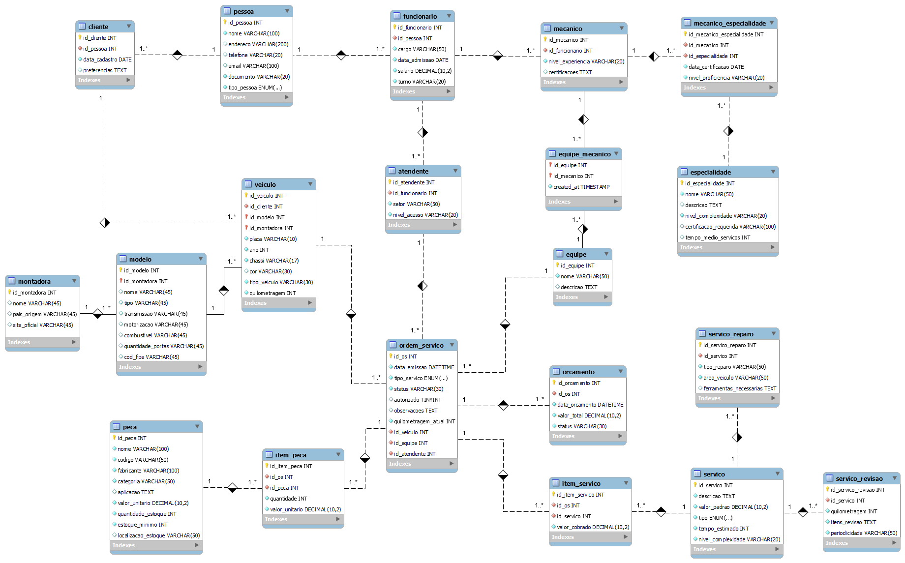

# Modelagem Lógica do Banco de Dados

## Introdução
A modelagem lógica é a segunda fase no processo de design de banco de dados, onde traduzimos o modelo conceitual em uma representação mais detalhada e específica, definindo tabelas, colunas, chaves e relacionamentos. Esta fase serve como ponte entre o modelo conceitual e o modelo físico, estabelecendo a estrutura que será implementada no Sistema Gerenciador de Banco de Dados (SGBD).

## Utilização
A modelagem lógica deve ser utilizada para:
- Definir a estrutura precisa das tabelas e seus campos
- Estabelecer as chaves primárias e estrangeiras
- Implementar as regras de integridade referencial
- Especificar os tipos de dados e restrições
- Documentar as relações entre as tabelas do sistema

## Estrutura de Navegação
- [Diagrama ER](#diagrama-er)
- [Pessoa](#pessoa)
- [Cliente](#cliente)
- [Funcionario](#funcionario)
- [Mecanico](#mecanico)
- [Atendente](#atendente)
- [Montadora](#montadora)
- [Modelo](#modelo)
- [Veiculo](#veiculo)
- [Especialidade](#especialidade)
- [Mecanico_Especialidade](#mecanico_especialidade)
- [Equipe](#equipe)
- [Equipe_Mecanico](#equipe_mecanico)
- [Servico](#servico)
- [Servico_Revisao](#servico_revisao)
- [Servico_Reparo](#servico_reparo)
- [Ordem_Servico](#ordem_servico)
- [Orcamento](#orcamento)
- [Item_Servico](#item_servico)
- [Peca](#peca)
- [Item_Peca](#item_peca)

## Diagrama ER


## Definição das Tabelas

### Pessoa
```sql
CREATE TABLE pessoa (
    id_pessoa INT AUTO_INCREMENT PRIMARY KEY,
    nome VARCHAR(100) NOT NULL,
    endereco VARCHAR(200),
    telefone VARCHAR(20),
    email VARCHAR(100),
    documento VARCHAR(20) UNIQUE NOT NULL,
    tipo_pessoa ENUM('CLIENTE', 'FUNCIONARIO') NOT NULL
);
```
[Voltar ao topo](#estrutura-de-navegação)

### Cliente
```sql
CREATE TABLE cliente (
    id_cliente INT AUTO_INCREMENT PRIMARY KEY,
    id_pessoa INT UNIQUE NOT NULL,
    data_cadastro DATE NOT NULL,
    preferencias TEXT,
    FOREIGN KEY (id_pessoa) REFERENCES pessoa(id_pessoa)
);
```
[Voltar ao topo](#estrutura-de-navegação)

### Funcionario
```sql
CREATE TABLE funcionario (
    id_funcionario INT AUTO_INCREMENT PRIMARY KEY,
    id_pessoa INT UNIQUE NOT NULL,
    cargo VARCHAR(50) NOT NULL,
    data_admissao DATE NOT NULL,
    salario DECIMAL(10,2) NOT NULL,
    turno VARCHAR(20) NOT NULL,
    FOREIGN KEY (id_pessoa) REFERENCES pessoa(id_pessoa)
);
```
[Voltar ao topo](#estrutura-de-navegação)

### Mecanico
```sql
CREATE TABLE mecanico (
    id_mecanico INT AUTO_INCREMENT PRIMARY KEY,
    id_funcionario INT UNIQUE NOT NULL,
    nivel_experiencia VARCHAR(20) NOT NULL,
    certificacoes TEXT,
    FOREIGN KEY (id_funcionario) REFERENCES funcionario(id_funcionario)
);
```
[Voltar ao topo](#estrutura-de-navegação)

### Atendente
```sql
CREATE TABLE atendente (
    id_atendente INT AUTO_INCREMENT PRIMARY KEY,
    id_funcionario INT UNIQUE NOT NULL,
    setor VARCHAR(50) NOT NULL,
    nivel_acesso VARCHAR(20) NOT NULL,
    FOREIGN KEY (id_funcionario) REFERENCES funcionario(id_funcionario)
);
```
[Voltar ao topo](#estrutura-de-navegação)

### Montadora
```sql
CREATE TABLE montadora (
    id_montadora INT AUTO_INCREMENT PRIMARY KEY,
    nome VARCHAR(45) NOT NULL,
    pais_origem VARCHAR(45),
    site_oficial VARCHAR(100)
);
```
[Voltar ao topo](#estrutura-de-navegação)

### Modelo
```sql
CREATE TABLE modelo (
    id_modelo INT AUTO_INCREMENT,
    id_montadora INT NOT NULL,
    nome VARCHAR(45) NOT NULL,
    tipo VARCHAR(45) NOT NULL,
    transmissao VARCHAR(45),
    motorizacao VARCHAR(45),
    combustivel VARCHAR(45),
    quantidade_portas INT,
    cod_fipe VARCHAR(45) UNIQUE,
    PRIMARY KEY (id_modelo, id_montadora),
    FOREIGN KEY (id_montadora) REFERENCES montadora(id_montadora)
);
```
[Voltar ao topo](#estrutura-de-navegação)

### Veiculo
```sql
CREATE TABLE veiculo (
    id_veiculo INT AUTO_INCREMENT PRIMARY KEY,
    id_cliente INT NOT NULL,
    id_modelo INT NOT NULL,
    id_montadora INT NOT NULL,
    placa VARCHAR(10) UNIQUE NOT NULL,
    ano INT NOT NULL,
    chassi VARCHAR(17) UNIQUE NOT NULL,
    cor VARCHAR(30),
    tipo_veiculo VARCHAR(30) NOT NULL,
    quilometragem INT NOT NULL,
    FOREIGN KEY (id_cliente) REFERENCES cliente(id_cliente),
    FOREIGN KEY (id_modelo, id_montadora) REFERENCES modelo(id_modelo, id_montadora)
);
```
[Voltar ao topo](#estrutura-de-navegação)

### Especialidade
```sql
CREATE TABLE especialidade (
    id_especialidade INT AUTO_INCREMENT PRIMARY KEY,
    nome VARCHAR(50) NOT NULL,
    descricao TEXT,
    nivel_complexidade VARCHAR(20) NOT NULL,
    certificacao_requerida VARCHAR(100),
    tempo_medio_servicos INT
);
```
[Voltar ao topo](#estrutura-de-navegação)

### Mecanico_Especialidade
```sql
CREATE TABLE mecanico_especialidade (
    id_mecanico_especialidade INT AUTO_INCREMENT PRIMARY KEY,
    id_mecanico INT NOT NULL,
    id_especialidade INT NOT NULL,
    data_certificacao DATE NOT NULL,
    nivel_proficiencia VARCHAR(20) NOT NULL,
    principal BOOLEAN DEFAULT false,
    UNIQUE KEY (id_mecanico, id_especialidade),
    FOREIGN KEY (id_mecanico) REFERENCES mecanico(id_mecanico),
    FOREIGN KEY (id_especialidade) REFERENCES especialidade(id_especialidade)
);
```
[Voltar ao topo](#estrutura-de-navegação)

### Equipe
```sql
CREATE TABLE equipe (
    id_equipe INT AUTO_INCREMENT PRIMARY KEY,
    nome VARCHAR(50) NOT NULL,
    descricao TEXT
);
```
[Voltar ao topo](#estrutura-de-navegação)

### Equipe_Mecanico
```sql
CREATE TABLE equipe_mecanico (
    id_equipe INT,
    id_mecanico INT,
    PRIMARY KEY (id_equipe, id_mecanico),
    FOREIGN KEY (id_equipe) REFERENCES equipe(id_equipe),
    FOREIGN KEY (id_mecanico) REFERENCES mecanico(id_mecanico)
);
```
[Voltar ao topo](#estrutura-de-navegação)

### Servico
```sql
CREATE TABLE servico (
    id_servico INT AUTO_INCREMENT PRIMARY KEY,
    descricao TEXT NOT NULL,
    valor_padrao DECIMAL(10,2) NOT NULL,
    tipo ENUM('REVISAO', 'REPARO') NOT NULL,
    tempo_estimado INT NOT NULL,
    nivel_complexidade VARCHAR(20) NOT NULL
);
```
[Voltar ao topo](#estrutura-de-navegação)

### Servico_Revisao
```sql
CREATE TABLE servico_revisao (
    id_servico_revisao INT AUTO_INCREMENT PRIMARY KEY,
    id_servico INT UNIQUE NOT NULL,
    quilometragem INT NOT NULL,
    itens_revisao TEXT NOT NULL,
    periodicidade VARCHAR(50) NOT NULL,
    FOREIGN KEY (id_servico) REFERENCES servico(id_servico)
);
```
[Voltar ao topo](#estrutura-de-navegação)

### Servico_Reparo
```sql
CREATE TABLE servico_reparo (
    id_servico_reparo INT AUTO_INCREMENT PRIMARY KEY,
    id_servico INT UNIQUE NOT NULL,
    tipo_reparo VARCHAR(50) NOT NULL,
    area_veiculo VARCHAR(50) NOT NULL,
    ferramentas_necessarias TEXT,
    FOREIGN KEY (id_servico) REFERENCES servico(id_servico)
);
```
[Voltar ao topo](#estrutura-de-navegação)

### Ordem_Servico
```sql
CREATE TABLE ordem_servico (
    id_os INT AUTO_INCREMENT PRIMARY KEY,
    data_emissao DATETIME NOT NULL,
    tipo_servico ENUM('REVISAO', 'REPARO') NOT NULL,
    status VARCHAR(30) NOT NULL,
    valor_total DECIMAL(10,2),
    autorizado BOOLEAN DEFAULT false,
    observacoes TEXT,
    quilometragem_atual INT NOT NULL,
    id_veiculo INT NOT NULL,
    id_equipe INT NOT NULL,
    id_atendente INT NOT NULL,
    FOREIGN KEY (id_veiculo) REFERENCES veiculo(id_veiculo),
    FOREIGN KEY (id_equipe) REFERENCES equipe(id_equipe),
    FOREIGN KEY (id_atendente) REFERENCES atendente(id_atendente)
);
```
[Voltar ao topo](#estrutura-de-navegação)

### Orcamento
```sql
CREATE TABLE orcamento (
    id_orcamento INT AUTO_INCREMENT PRIMARY KEY,
    id_os INT UNIQUE NOT NULL,
    data_orcamento DATETIME NOT NULL,
    valor_total DECIMAL(10,2) NOT NULL,
    status VARCHAR(30) NOT NULL,
    FOREIGN KEY (id_os) REFERENCES ordem_servico(id_os)
);
```
[Voltar ao topo](#estrutura-de-navegação)

### Item_Servico
```sql
CREATE TABLE item_servico (
    id_item_servico INT AUTO_INCREMENT PRIMARY KEY,
    id_os INT NOT NULL,
    id_servico INT NOT NULL,
    valor_cobrado DECIMAL(10,2) NOT NULL,
    FOREIGN KEY (id_os) REFERENCES ordem_servico(id_os),
    FOREIGN KEY (id_servico) REFERENCES servico(id_servico)
);
```
[Voltar ao topo](#estrutura-de-navegação)

### Peca
```sql
CREATE TABLE peca (
    id_peca INT AUTO_INCREMENT PRIMARY KEY,
    nome VARCHAR(100) NOT NULL,
    codigo VARCHAR(50) UNIQUE NOT NULL,
    fabricante VARCHAR(100) NOT NULL,
    categoria VARCHAR(50) NOT NULL,
    aplicacao TEXT,
    valor_unitario DECIMAL(10,2) NOT NULL,
    quantidade_estoque INT NOT NULL,
    estoque_minimo INT NOT NULL,
    localizacao_estoque VARCHAR(50)
);
```
[Voltar ao topo](#estrutura-de-navegação)

### Item_Peca
```sql
CREATE TABLE item_peca (
    id_item_peca INT AUTO_INCREMENT PRIMARY KEY,
    id_os INT NOT NULL,
    id_peca INT NOT NULL,
    quantidade INT NOT NULL,
    valor_unitario DECIMAL(10,2) NOT NULL,
    FOREIGN KEY (id_os) REFERENCES ordem_servico(id_os),
    FOREIGN KEY (id_peca) REFERENCES peca(id_peca)
);
```
[Voltar ao topo](#estrutura-de-navegação)

## Observações Importantes

1. **Integridade Referencial:**
   - Todas as chaves estrangeiras têm referências explícitas
   - Relacionamentos N:N foram decompostos em tabelas associativas
   - Chaves estrangeiras garantem a consistência entre tabelas relacionadas
   - Exclusões em cascata foram evitadas para manter a integridade dos dados históricos

2. **Tipos de Dados:**
   - DECIMAL(10,2) para valores monetários com precisão de 2 casas decimais
   - VARCHAR com limites apropriados para cada tipo de dado
   - TEXT para campos longos como descrições e observações
   - ENUM para campos com valores predefinidos
   - INT para identificadores e valores numéricos
   - DATETIME para registros temporais precisos
   - DATE para datas sem necessidade de hora
   - BOOLEAN para flags e estados binários

3. **Restrições:**
   - NOT NULL em campos obrigatórios
   - UNIQUE para campos que não podem ter duplicatas
   - DEFAULT valores definidos quando apropriado
   - CHECK constraints implícitos através de ENUMs
   - AUTO_INCREMENT para geração automática de IDs

4. **Especializações:**
   - Implementadas através de tabelas separadas com chaves estrangeiras
   - Relação 1:1 entre tabela genérica e especializada
   - Herança implementada através de relacionamentos
   - Tipos específicos identificados através de ENUMs na tabela pai
